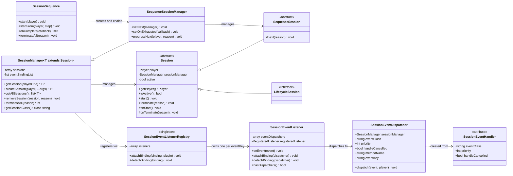

# session-utils

<!-- PROJECT BADGES -->
<div align="center">

[![Poggit CI][poggit-ci-badge]][poggit-ci-url]
[![Stars][stars-badge]][stars-url]
[![License][license-badge]][license-url]

</div>

<br />
<div align="center">
  
  <h3>session-utils</h3>
  <p>General-purpose player session management library</p>

[Korean README](README_KOR.md) · [Report a bug][issues-url] · [Request a feature][issues-url]

</div>

---

## Overview

`session-utils` is a virion for PMMP plugin developers that eliminates session management boilerplate. Instead of
writing lifecycle listeners and event routing from scratch for every feature, you declare what you need and the library
handles the rest.

**What it does:**

- Automatically creates and destroys sessions on player join/quit (for lifecycle sessions)
- Routes PMMP events to the correct player's session using `#[SessionEventHandler]` attributes — no listener classes to write
- Supports ordered session progression via `SessionSequence` for multi-step flows like tutorials
- Prevents duplicate PMMP listener registration across multiple session types via a global registry
- Provides a generic, type-safe `SessionManager<T>` for clean plugin architecture

---

## Requirements

- PocketMine-MP **5.x**
- PHP **8.2+**

---

## Architecture



### Event flow

```
PMMP fires event
  → SessionEventListener::onEvent()
    → [cancelled mid-dispatch? stop if handleCancelled=false]
    → SessionEventDispatcher::dispatch()
      → SessionManager::getSession(player)
        → Session::{methodName}(event)
```

---

## Core Components

### `Session` (abstract class)

Base class for all session types. Holds the `Player` and `SessionManager` references and manages `active` state.
Exposes `onStart()` and `onTerminate()` hooks for subclasses to implement.

Calling `terminate()` inside a session class will self-terminate the session via the owning `SessionManager`.

### `SequenceSession` (abstract class)

Extends `Session` for use within a `SessionSequence`. Adds `next()` to advance the sequence to the next step.
Must not implement `LifecycleSession`.

**Key methods:**

- `protected function next(string $reason)` — Terminates this session and starts the next step in the sequence.
  If this is the last step, the sequence's `onComplete` callback is invoked instead.

### `LifecycleSession` (interface)

Marker interface. Classes implementing this are automatically created on `PlayerJoinEvent` and destroyed on
`PlayerQuitEvent` by `SessionManager`. Must not be combined with `SequenceSession`.

### `SessionSequence` (class)

Manages an ordered progression of `SequenceSession` subclasses for a single player.
Internally creates and chains a `SequenceSessionManager` per step.

All session classes passed to `SessionSequence` must extend `SequenceSession` and must not implement `LifecycleSession`
— this is enforced at construction time.

**Key methods:**

- `start(Player $player)` — Starts the sequence from the first step.
- `startFrom(Player $player, int|string $step)` — Starts from a specific step by 0-based index or class-string.
- `onComplete(Closure $callback)` — Registers a callback invoked when the last session calls `next()`.
- `terminateAll(string $reason)` — Terminates all active sessions across all steps.

### `SessionManager<T>` (class)

Central orchestrator for one session type. On construction:

1. Scans the session class for `#[SessionEventHandler]` attributes
2. Registers the resulting dispatchers with `SessionEventListenerRegistry`
3. Registers join/quit lifecycle listeners (if `LifecycleSession`)

### `#[SessionEventHandler]` (attribute)

Declares a method as a session-scoped event handler. Can be applied multiple times on the same method for different
events. The method must be `public` and accept exactly one non-nullable `Event` subclass parameter.

### `SessionEventListenerRegistry` (singleton)

Ensures only one PMMP listener exists per unique `(eventClass, priority, handleCancelled)` combination — the **eventKey**.
Multiple session types subscribing to the same event share a single PMMP listener.

### `SessionEventListener` (class)

The actual PMMP-registered listener for one eventKey. Holds a list of `SessionEventDispatcher` instances and routes
each fired event to the correct player's session. Respects cancellation state mid-dispatch.

### `SessionEventDispatcher` (class)

Represents one `#[SessionEventHandler]` binding. Holds its event configuration (`eventKey`), the target
`SessionManager`, and the method name to invoke. Called by `SessionEventListener` on each event.

### `SessionTerminateReasons` (interface)

Built-in termination reason constants. Custom string reasons are allowed — these exist to avoid typos and keep semantics
consistent across plugins.

---

## File Structure

```
src/kim/present/utils/session/
├── Session.php
├── SequenceSession.php
├── LifecycleSession.php
├── SessionManager.php
├── SequenceSessionManager.php
├── SessionSequence.php
├── SessionTerminateReasons.php
└── listener/
    ├── SessionEventDispatcher.php
    ├── SessionEventListener.php
    ├── SessionEventListenerRegistry.php
    └── attribute/
        └── SessionEventHandler.php
```

---

## Usage

### 1. Define a lifecycle session

Extend `Session` and implement `LifecycleSession` for automatic join/quit management.
Declare event handlers with `#[SessionEventHandler]` — no separate listener class needed.

```php
use pocketmine\event\block\BlockBreakEvent;
use pocketmine\event\player\PlayerInteractEvent;
use kim\present\utils\session\Session;
use kim\present\utils\session\LifecycleSession;
use kim\present\utils\session\SessionTerminateReasons;
use kim\present\utils\session\listener\attribute\SessionEventHandler;

final class WorldEditSession extends Session implements LifecycleSession{

    private ?array $pos1 = null;
    private ?array $pos2 = null;

    protected function onStart() : void{
        $this->getPlayer()->sendMessage("WorldEdit session started.");
    }

    protected function onTerminate(string $reason) : void{
        // save state, clean up, etc.
    }

    #[SessionEventHandler(BlockBreakEvent::class)]
    public function onBlockBreak(BlockBreakEvent $event) : void{
        $pos = $event->getBlock()->getPosition();
        $this->pos1 = [$pos->x, $pos->y, $pos->z];
        $event->cancel();
    }

    #[SessionEventHandler(PlayerInteractEvent::class)]
    public function onInteract(PlayerInteractEvent $event) : void{
        $pos = $event->getBlock()->getPosition();
        $this->pos2 = [$pos->x, $pos->y, $pos->z];

        if($this->pos1 !== null){
            // Self-terminate when both positions are selected
            $this->terminate(SessionTerminateReasons::COMPLETED);
        }
    }
}
```

### 2. Bootstrap from your plugin

```php
use pocketmine\plugin\PluginBase;
use kim\present\utils\session\SessionManager;
use kim\present\utils\session\SessionTerminateReasons;

final class MyPlugin extends PluginBase{
    private SessionManager $sessionManager;

    protected function onEnable() : void{
        $this->sessionManager = new SessionManager($this, WorldEditSession::class);
    }

    protected function onDisable() : void{
        $this->sessionManager->terminateAll(SessionTerminateReasons::PLUGIN_DISABLE);
    }
}
```

### 3. Manage sessions manually

```php
// Create a session on demand (for non-lifecycle sessions)
$session = $this->sessionManager->createSession($player);

// Retrieve a session
$session = $this->sessionManager->getSession($player);

// Remove a specific session
$this->sessionManager->removeSession($player, SessionTerminateReasons::MANUAL);

// Terminate all sessions (e.g. on plugin disable)
$count = $this->sessionManager->terminateAll(SessionTerminateReasons::PLUGIN_DISABLE);
```

### Lifecycle sessions vs. task sessions

|           | Lifecycle session                  | Task session                   |
|-----------|------------------------------------|--------------------------------|
| Interface | `LifecycleSession`                 | (none)                         |
| Created   | Automatically on `PlayerJoinEvent` | Manually via `createSession()` |
| Destroyed | Automatically on `PlayerQuitEvent` | Manually via `removeSession()` |
| Use case  | Per-player persistent state        | On-demand feature sessions     |

---

### 4. Define a sequence session

For multi-step flows (e.g. tutorials), extend `SequenceSession` and call `next()` to advance to the next step.

```php
use pocketmine\event\block\BlockBreakEvent;
use pocketmine\event\block\BlockPlaceEvent;
use kim\present\utils\session\SequenceSession;
use kim\present\utils\session\listener\attribute\SessionEventHandler;

final class TutorialStep1Session extends SequenceSession{

    protected function onStart() : void{
        $this->getPlayer()->sendMessage("Step 1: Break a block.");
    }

    protected function onTerminate(string $reason) : void{}

    #[SessionEventHandler(BlockBreakEvent::class)]
    public function onBlockBreak(BlockBreakEvent $event) : void{
        $this->getPlayer()->sendMessage("Step 1 complete!");
        $this->next(); // Advances to TutorialStep2Session
    }
}

final class TutorialStep2Session extends SequenceSession{

    protected function onStart() : void{
        $this->getPlayer()->sendMessage("Step 2: Place a block.");
    }

    protected function onTerminate(string $reason) : void{}

    #[SessionEventHandler(BlockPlaceEvent::class)]
    public function onBlockPlace(BlockPlaceEvent $event) : void{
        $this->getPlayer()->sendMessage("Step 2 complete!");
        $this->next(); // No next step — triggers onComplete callback
    }
}
```

### 5. Bootstrap a sequence

```php
use pocketmine\plugin\PluginBase;
use pocketmine\player\Player;
use kim\present\utils\session\SessionSequence;
use kim\present\utils\session\SessionTerminateReasons;

final class MyPlugin extends PluginBase{
    private SessionSequence $tutorialSequence;

    protected function onEnable() : void{
        $this->tutorialSequence = new SessionSequence($this,
            TutorialStep1Session::class,
            TutorialStep2Session::class,
        );

        $this->tutorialSequence->onComplete(function(Player $player) : void{
            $player->sendMessage("Tutorial complete!");
            $this->saveProgress($player, completed: true);
        });
    }

    protected function onDisable() : void{
        $this->tutorialSequence->terminateAll(SessionTerminateReasons::PLUGIN_DISABLE);
    }

    public function startTutorial(Player $player) : void{
        $progress = $this->loadProgress($player); // e.g. 0, 1

        if($progress === 0){
            $this->tutorialSequence->start($player);
        }else{
            // Resume from where the player left off (by index or class-string)
            $this->tutorialSequence->startFrom($player, $progress);
        }
    }
}
```

---

## Termination reasons

`terminate(string $reason)` accepts any string. Built-in constants are provided by `SessionTerminateReasons`:

| Constant         | Value              | Description                          |
|------------------|--------------------|--------------------------------------|
| `MANUAL`         | `"manual"`         | Explicitly terminated by plugin code |
| `PLAYER_QUIT`    | `"player_quit"`    | Player disconnected                  |
| `PLUGIN_DISABLE` | `"plugin_disable"` | Owning plugin was disabled           |
| `START_FAILED`   | `"start_failed"`   | Session failed to initialize         |
| `COMPLETED`      | `"completed"`      | Session reached its end state        |
| `CANCELLED`      | `"cancelled"`      | Session abandoned before completion  |
| `TIMEOUT`        | `"timeout"`        | Session exceeded allotted time       |
| `RESTART`        | `"restart"`        | Session terminated to restart fresh  |
| `MAINTENANCE`    | `"maintenance"`    | Server maintenance                   |

---

## Installation

See [Official Poggit Virion Documentation](https://github.com/poggit/support/blob/master/virion.md).

---

## License

Distributed under the **MIT License**. See [LICENSE][license-url] for more information.

---

[poggit-ci-badge]: https://poggit.pmmp.io/ci.shield/presentkim-pm/session-utils/session-utils?style=for-the-badge
[stars-badge]: https://img.shields.io/github/stars/presentkim-pm/session-utils.svg?style=for-the-badge
[license-badge]: https://img.shields.io/github/license/presentkim-pm/session-utils.svg?style=for-the-badge
[stars-url]: https://github.com/presentkim-pm/session-utils/stargazers
[issues-url]: https://github.com/presentkim-pm/session-utils/issues
[license-url]: https://github.com/presentkim-pm/session-utils/blob/main/LICENSE
