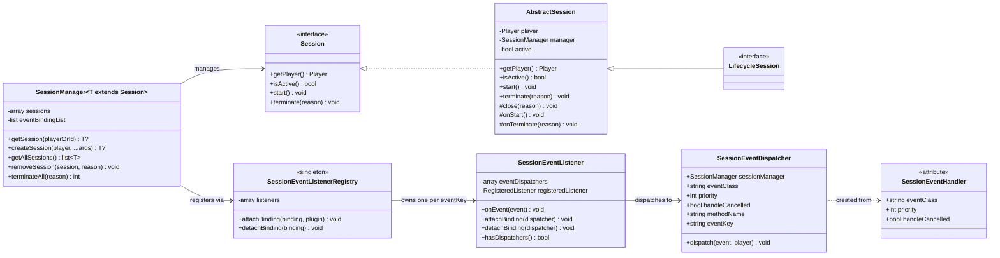

# session-utils

<!-- PROJECT BADGES -->
<div align="center">

[![Poggit CI][poggit-ci-badge]][poggit-ci-url]
[![Stars][stars-badge]][stars-url]
[![License][license-badge]][license-url]

</div>

<br />
<div align="center">
  
  <h3>session-utils</h3>
  <p>General-purpose player session management library</p>

[Korean README](README_KOR.md) · [Report a bug][issues-url] · [Request a feature][issues-url]

</div>

---

## Overview

`session-utils` is a virion for PMMP plugin developers that eliminates session management boilerplate. Instead of
writing lifecycle listeners and event routing from scratch for every feature, you declare what you need and the library
handles the rest.

**What it does:**

- Automatically creates and destroys sessions on player join/quit (for lifecycle sessions)
- Routes PMMP events to the correct player's session using `#[SessionEventHandler]` attributes — no listener classes to
  write
- Prevents duplicate PMMP listener registration across multiple session types via a global registry
- Provides a generic, type-safe `SessionManager<T>` for clean plugin architecture

---

## Requirements

- PocketMine-MP **5.x**
- PHP **8.2+**

---

## Architecture



### Event flow

```
PMMP fires event
  → SessionEventListener::onEvent()
    → [cancelled mid-dispatch? stop if handleCancelled=false]
    → SessionEventDispatcher::dispatch()
      → SessionManager::getSession(player)
        → Session::{methodName}(event)
```

---

## Core Components

### `Session` (interface)

Contract for all session types. Defines lifecycle control (`start`, `terminate`) and player access.

### `LifecycleSession` (interface)

Marker interface. Classes implementing this are automatically created on `PlayerJoinEvent` and destroyed on
`PlayerQuitEvent` by `SessionManager`.

### `AbstractSession` (abstract class)

Base implementation for all session types. Holds the `Player` and `SessionManager` references, manages `active` state.
Exposes `onStart()` and `onTerminate()` hooks for subclasses.

**Key methods:**

- `protected function close(string $reason)` — Convenience method that calls
  `$this->manager->removeSession($this, $reason)`. Use this inside session classes to terminate themselves with a single
  call.

### `SessionManager<T>` (class)

Central orchestrator for one session type. On construction :

1. Scans the session class for `#[SessionEventHandler]` attributes
2. Registers the resulting dispatchers with `SessionEventListenerRegistry`
3. Registers join/quit lifecycle listeners (if `LifecycleSession`)

### `#[SessionEventHandler]` (attribute)

Declares a method as a session-scoped event handler. Can be applied multiple times on the same method for different
events. The method must be `public` and accept exactly one non-nullable `Event` subclass parameter.

### `SessionEventListenerRegistry` (singleton)

Ensures only one PMMP listener exists per unique `(eventClass, priority, handleCancelled)` combination — the **eventKey
**. Multiple session types subscribing to the same event share a single PMMP listener.

### `SessionEventListener` (class)

The actual PMMP-registered listener for one eventKey. Holds a list of `SessionEventDispatcher` instances and routes each
fired event to the correct player's session. Respects cancellation state mid-dispatch.

### `SessionEventDispatcher` (class)

Represents one `#[SessionEventHandler]` binding. Holds its event configuration (`eventKey`), the target
`SessionManager`, and the method name to invoke. Called by `SessionEventListener` on each event.

### `SessionTerminateReasons` (interface)

Built-in termination reason constants. Custom string reasons are allowed — these exist to avoid typos and keep semantics
consistent across plugins.

---

## File Structure

```
src/kim/present/utils/session/
├── Session.php
├── AbstractSession.php
├── LifecycleSession.php
├── SessionManager.php
├── SessionTerminateReasons.php
└── listener/
    ├── SessionEventDispatcher.php
    ├── SessionEventListener.php
    ├── SessionEventListenerRegistry.php
    └── attribute/
        └── SessionEventHandler.php
```

---

## Usage

### 1. Define a session

Extend `AbstractSession` and implement `LifecycleSession` for automatic join/quit management.
Declare event handlers with `#[SessionEventHandler]` — no separate listener class needed.

```php
use pocketmine\event\block\BlockBreakEvent;
use pocketmine\event\player\PlayerInteractEvent;
use kim\present\utils\session\AbstractSession;
use kim\present\utils\session\LifecycleSession;
use kim\present\utils\session\listener\attribute\SessionEventHandler;

final class WorldEditSession extends AbstractSession implements LifecycleSession{

    private ?array $pos1 = null;
    private ?array $pos2 = null;

    protected function onStart() : void{
        $this->getPlayer()->sendMessage("WorldEdit session started.");
    }

    protected function onTerminate(string $reason) : void{
        // save state, clean up, etc.
    }

    #[SessionEventHandler(BlockBreakEvent::class)]
    public function onBlockBreak(BlockBreakEvent $event) : void{
        // Only called for this session's player
        $pos = $event->getBlock()->getPosition();
        $this->pos1 = [$pos->x, $pos->y, $pos->z];
        $event->cancel();

        // Use $this->close() to terminate this session
        if($this->pos1 !== null && $this->pos2 !== null){
            $this->close(SessionTerminateReasons::COMPLETED);
        }
    }

    #[SessionEventHandler(PlayerInteractEvent::class)]
    public function onInteract(PlayerInteractEvent $event) : void{
        $pos = $event->getBlock()->getPosition();
        $this->pos2 = [$pos->x, $pos->y, $pos->z];
    }
}
```

### 2. Bootstrap from your plugin

```php
use pocketmine\plugin\PluginBase;
use kim\present\utils\session\SessionManager;

final class MyPlugin extends PluginBase{
    private SessionManager $sessionManager;

    protected function onEnable() : void{
        $this->sessionManager = new SessionManager($this, WorldEditSession::class);
    }

    protected function onDisable() : void{
        $this->sessionManager->terminateAll(SessionTerminateReasons::PLUGIN_DISABLE);
    }
}
```

### 3. Manage sessions manually

```php
// Create a session on demand (for non-lifecycle sessions)
$session = $this->sessionManager->createSession($player);

// Retrieve a session
$session = $this->sessionManager->getSession($player);

// Remove a specific session
$this->sessionManager->removeSession($player, SessionTerminateReasons::MANUAL);

// Terminate all sessions (e.g. on plugin disable)
$count = $this->sessionManager->terminateAll(SessionTerminateReasons::PLUGIN_DISABLE);
```

### Lifecycle sessions vs. task sessions

|           | Lifecycle session                  | Task session                       |
|-----------|------------------------------------|------------------------------------|
| Interface | `LifecycleSession`                 | (none)                             |
| Created   | Automatically on `PlayerJoinEvent` | Manually via `createSession()`     |
| Destroyed | Automatically on `PlayerQuitEvent` | Automatically on `PlayerQuitEvent` |
| Use case  | Per-player persistent state        | On-demand feature sessions         |

---

## Termination reasons

`terminate(string $reason)` accepts any string. Built-in constants are provided by `SessionTerminateReasons`:

| Constant         | Value              | Description                          |
|------------------|--------------------|--------------------------------------|
| `MANUAL`         | `"manual"`         | Explicitly terminated by plugin code |
| `PLAYER_QUIT`    | `"player_quit"`    | Player disconnected                  |
| `PLUGIN_DISABLE` | `"plugin_disable"` | Owning plugin was disabled           |
| `COMPLETED`      | `"completed"`      | Session reached its end state        |
| `CANCELLED`      | `"cancelled"`      | Session abandoned before completion  |
| `TIMEOUT`        | `"timeout"`        | Session exceeded allotted time       |
| `RESTART`        | `"restart"`        | Session terminated to restart fresh  |
| `MAINTENANCE`    | `"maintenance"`    | Server maintenance                   |

---

## Installation

See [Official Poggit Virion Documentation](https://github.com/poggit/support/blob/master/virion.md).

---

## License

Distributed under the **MIT License**. See [LICENSE][license-url] for more information.

---

[poggit-ci-badge]: https://poggit.pmmp.io/ci.shield/presentkim-pm/session-utils/session-utils?style=for-the-badge

[stars-badge]: https://img.shields.io/github/stars/presentkim-pm/session-utils.svg?style=for-the-badge

[license-badge]: https://img.shields.io/github/license/presentkim-pm/session-utils.svg?style=for-the-badge

[stars-url]: https://github.com/presentkim-pm/session-utils/stargazers

[issues-url]: https://github.com/presentkim-pm/session-utils/issues

[license-url]: https://github.com/presentkim-pm/session-utils/blob/main/LICENSE
