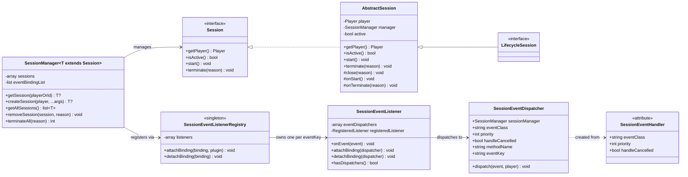

# session-utils

<!-- PROJECT BADGES -->
<div align="center">

[![Poggit CI][poggit-ci-badge]][poggit-ci-url]
[![Stars][stars-badge]][stars-url]
[![License][license-badge]][license-url]

</div>

<br />
<div align="center">
  
  <h3>session-utils</h3>
  <p>범용 플레이어 세션 관리 라이브러리</p>

[English README](README.md) · [버그 제보][issues-url] · [기능 요청][issues-url]

</div>

---

## 개요

`session-utils`는 PMMP 플러그인 개발자가 세션 관리 보일러플레이트를 줄일 수 있도록 돕는 virion입니다. 기능마다 라이프사이클 리스너와 이벤트 라우팅을 직접 작성하는 대신, 필요한 것을 선언하면
나머지는 라이브러리가 처리합니다.

**주요 기능:**

- 플레이어 접속/퇴장 시 세션 자동 생성 및 소멸 (라이프사이클 세션)
- `#[SessionEventHandler]` 어트리뷰트로 세션에 PMMP 이벤트 자동 라우팅 — 별도 리스너 클래스 불필요
- 전역 레지스트리를 통해 여러 세션 타입 간 PMMP 리스너 중복 등록 방지
- 타입 안전한 제네릭 `SessionManager<T>` 제공

---

## 요구사항

- PocketMine-MP **5.x**
- PHP **8.2+**

---

## 아키텍처



### 이벤트 흐름

```
PMMP 이벤트 발화
  → SessionEventListener::onEvent()
    → [취소된 이벤트? handleCancelled=false이면 중단]
    → SessionEventDispatcher::dispatch()
      → SessionManager::getSession(player)
        → Session::{methodName}(event)
```

---

## 핵심 컴포넌트

### `Session` (인터페이스)

모든 세션 타입의 공통 계약. 라이프사이클 제어(`start`, `terminate`)와 플레이어 접근을 정의합니다.

### `LifecycleSession` (인터페이스)

마커 인터페이스. 이 인터페이스를 구현한 클래스는 `PlayerJoinEvent` 시 자동 생성되고 `PlayerQuitEvent` 시 자동 소멸됩니다.

### `AbstractSession` (추상 클래스)

모든 세션 타입의 기본 구현. `Player`와 `SessionManager` 참조를 보유하고 `active` 상태를 관리합니다. 서브클래스에서 `onStart()`와 `onTerminate()` 훅을
오버라이드합니다.

**주요 메서드:**

- `protected function close(string $reason)` — `$this->manager->removeSession($this, $reason)`을 호출하는 편의 메서드. 세션 클래스 내부에서
  스스로를 종료할 때 사용합니다.

### `SessionManager<T>` (클래스)

하나의 세션 타입을 담당하는 중앙 오케스트레이터. 생성 시:

1. 세션 클래스의 `#[SessionEventHandler]` 어트리뷰트를 스캔
2. 생성된 디스패처를 `SessionEventListenerRegistry`에 등록
3. `LifecycleSession`이면 접속/퇴장 라이프사이클 리스너 등록

### `#[SessionEventHandler]` (어트리뷰트)

메서드를 세션 범위 이벤트 핸들러로 선언합니다. 같은 메서드에 여러 이벤트에 대해 중복 적용 가능합니다. 메서드는 `public`이어야 하고 null 불허 `Event` 서브클래스 파라미터를 정확히 하나 받아야
합니다.

### `SessionEventListenerRegistry` (싱글톤)

`(eventClass, priority, handleCancelled)` 조합 — **eventKey** — 당 PMMP 리스너가 하나만 존재하도록 보장합니다. 같은 이벤트를 구독하는 여러 세션 타입이 하나의
PMMP 리스너를 공유합니다.

### `SessionEventListener` (클래스)

하나의 eventKey에 대응하는 실제 PMMP 등록 리스너. `SessionEventDispatcher` 목록을 들고 발화된 이벤트를 해당 플레이어의 세션으로 라우팅합니다. 디스패치 도중 취소 상태를 반영합니다.

### `SessionEventDispatcher` (클래스)

`#[SessionEventHandler]` 바인딩 하나를 표현합니다. 이벤트 설정(`eventKey`), 대상 `SessionManager`, 호출할 메서드 이름을 보유합니다. 이벤트 발화 시
`SessionEventListener`에 의해 호출됩니다.

### `SessionTerminateReasons` (인터페이스)

내장 종료 사유 상수. 커스텀 문자열 사유도 허용되며, 이 상수들은 오타 방지와 플러그인 간 의미 통일을 위해 제공됩니다.

---

## 파일 구조

```
src/kim/present/utils/session/
├── Session.php
├── AbstractSession.php
├── LifecycleSession.php
├── SessionManager.php
├── SessionTerminateReasons.php
└── listener/
    ├── SessionEventDispatcher.php
    ├── SessionEventListener.php
    ├── SessionEventListenerRegistry.php
    └── attribute/
        └── SessionEventHandler.php
```

---

## 사용법

### 1. 세션 정의

`AbstractSession`을 상속하고 자동 접속/퇴장 관리를 원하면 `LifecycleSession`을 함께 구현합니다.
이벤트 핸들러는 `#[SessionEventHandler]`로 선언합니다 — 별도 리스너 클래스 불필요.

```php
use pocketmine\event\block\BlockBreakEvent;
use pocketmine\event\player\PlayerInteractEvent;
use kim\present\utils\session\AbstractSession;
use kim\present\utils\session\LifecycleSession;
use kim\present\utils\session\listener\attribute\SessionEventHandler;

final class WorldEditSession extends AbstractSession implements LifecycleSession{

    private ?array $pos1 = null;
    private ?array $pos2 = null;

    protected function onStart() : void{
        $this->getPlayer()->sendMessage("WorldEdit 세션이 시작되었습니다.");
    }

    protected function onTerminate(string $reason) : void{
        // 상태 저장, 정리 작업 등
    }

    #[SessionEventHandler(BlockBreakEvent::class)]
    public function onBlockBreak(BlockBreakEvent $event) : void{
        // 이 세션의 플레이어 이벤트만 전달받음
        $pos = $event->getBlock()->getPosition();
        $this->pos1 = [$pos->x, $pos->y, $pos->z];
        $event->cancel();

        // $this->close()로 세션 스스로 종료
        if($this->pos1 !== null && $this->pos2 !== null){
            $this->close(SessionTerminateReasons::COMPLETED);
        }
    }

    #[SessionEventHandler(PlayerInteractEvent::class)]
    public function onInteract(PlayerInteractEvent $event) : void{
        $pos = $event->getBlock()->getPosition();
        $this->pos2 = [$pos->x, $pos->y, $pos->z];
    }
}
```

### 2. 플러그인에서 부트스트랩

```php
use pocketmine\plugin\PluginBase;
use kim\present\utils\session\SessionManager;

final class MyPlugin extends PluginBase{
    private SessionManager $sessionManager;

    protected function onEnable() : void{
        $this->sessionManager = new SessionManager($this, WorldEditSession::class);
    }

    protected function onDisable() : void{
        $this->sessionManager->terminateAll(SessionTerminateReasons::PLUGIN_DISABLE);
    }
}
```

### 3. 수동 세션 관리

```php
// 세션 수동 생성 (라이프사이클 세션이 아닌 경우)
$session = $this->sessionManager->createSession($player);

// 세션 조회
$session = $this->sessionManager->getSession($player);

// 특정 세션 제거
$this->sessionManager->removeSession($player, SessionTerminateReasons::MANUAL);

// 모든 세션 종료 (플러그인 비활성화 시 등)
$count = $this->sessionManager->terminateAll(SessionTerminateReasons::PLUGIN_DISABLE);
```

### 라이프사이클 세션 vs. 태스크 세션

|       | 라이프사이클 세션              | 태스크 세션                 |
|-------|------------------------|------------------------|
| 인터페이스 | `LifecycleSession`     | (없음)                   |
| 생성    | `PlayerJoinEvent` 시 자동 | `createSession()`으로 수동 |
| 소멸    | `PlayerQuitEvent` 시 자동 | `removeSession()`으로 수동 |
| 용도    | 플레이어별 지속 상태            | 온디맨드 기능 세션             |

---

## 종료 사유

`terminate(string $reason)`은 임의의 문자열을 허용합니다. `SessionTerminateReasons`로 내장 상수를 제공합니다:

| 상수               | 값                  | 설명                  |
|------------------|--------------------|---------------------|
| `MANUAL`         | `"manual"`         | 플러그인 코드에서 명시적으로 종료  |
| `PLAYER_QUIT`    | `"player_quit"`    | 플레이어 접속 종료          |
| `PLUGIN_DISABLE` | `"plugin_disable"` | 소유 플러그인 비활성화        |
| `START_FAILED`   | `"start_failed"`   | 초기화 실패로 활성화 전 종료    |
| `COMPLETED`      | `"completed"`      | 세션이 정상적으로 종료 상태에 도달 |
| `CANCELLED`      | `"cancelled"`      | 종료 상태 도달 전 중단       |
| `TIMEOUT`        | `"timeout"`        | 허용 시간 초과로 강제 종료     |
| `RESTART`        | `"restart"`        | 재시작을 위해 종료          |
| `MAINTENANCE`    | `"maintenance"`    | 서버 점검으로 인한 종료       |

---

## 설치

[Official Poggit Virion Documentation](https://github.com/poggit/support/blob/master/virion.md)을 참고해주세요.

---

## 라이선스

**MIT License** 하에 배포됩니다. 자세한 내용은 [LICENSE][license-url]를 확인해주세요.

---

[poggit-ci-badge]: https://poggit.pmmp.io/ci.shield/presentkim-pm/session-utils/session-utils?style=for-the-badge

[stars-badge]: https://img.shields.io/github/stars/presentkim-pm/session-utils.svg?style=for-the-badge

[license-badge]: https://img.shields.io/github/license/presentkim-pm/session-utils.svg?style=for-the-badge

[stars-url]: https://github.com/presentkim-pm/session-utils/stargazers

[issues-url]: https://github.com/presentkim-pm/session-utils/issues

[license-url]: https://github.com/presentkim-pm/session-utils/blob/main/LICENSE
