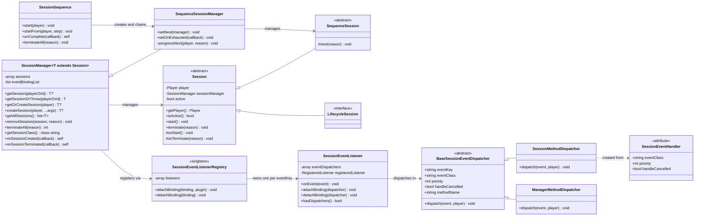

# session-utils

<!-- PROJECT BADGES -->
<div align="center">

[![Poggit CI][poggit-ci-badge]][poggit-ci-url]
[![Stars][stars-badge]][stars-url]
[![License][license-badge]][license-url]

</div>

<br />
<div align="center">
  
  <h3>session-utils</h3>
  <p>범용 플레이어 세션 관리 라이브러리</p>

[English README](README.md) · [버그 제보][issues-url] · [기능 요청][issues-url]

</div>

---

## 개요

`session-utils`는 PMMP 플러그인 개발자가 세션 관리 보일러플레이트를 줄일 수 있도록 돕는 virion입니다. 기능마다 라이프사이클 리스너와 이벤트 라우팅을 직접 작성하는 대신, 필요한 것을 선언하면
나머지는 라이브러리가 처리합니다.

**주요 기능:**

- 플레이어 접속/퇴장 시 세션 자동 생성 및 소멸 (라이프사이클 세션)
- `#[SessionEventHandler]` 어트리뷰트로 세션에 PMMP 이벤트 자동 라우팅 — 별도 리스너 클래스 불필요
- `SessionSequence`를 통한 튜토리얼 등 다단계 흐름의 순차적 세션 진행 지원
- 전역 레지스트리를 통해 여러 세션 타입 간 PMMP 리스너 중복 등록 방지
- 타입 안전한 제네릭 `SessionManager<T>` 제공

---

## 요구사항

- PocketMine-MP **5.x**
- PHP **8.2+**

---

## 아키텍처



### 이벤트 흐름

```
PMMP 이벤트 발화
  → SessionEventListener::onEvent()
    → [취소된 이벤트? handleCancelled=false이면 중단]
    → BaseSessionEventDispatcher::dispatch()
      ├─ SessionMethodDispatcher → SessionManager::getSession(player) → Session::{methodName}(event)
      └─ ManagerMethodDispatcher → SessionManager::{methodName}(event)
```

---

## 핵심 컴포넌트

### `Session` (추상 클래스)

모든 세션 타입의 기반 클래스. `Player`와 `SessionManager` 참조를 보유하고 `active` 상태를 관리합니다.
서브클래스에서 `onStart()`와 `onTerminate()` 훅을 구현합니다.

세션 클래스 내부에서 `terminate()`를 호출하면 소유 `SessionManager`를 통해 스스로를 종료할 수 있습니다.

### `SequenceSession` (추상 클래스)

`SessionSequence`에서 사용하기 위해 `Session`을 상속한 클래스. 시퀀스를 다음 단계로 진행시키는 `next()`를 추가합니다.
`LifecycleSession`을 함께 구현해선 안 됩니다.

**주요 메서드:**

- `protected function next(string $reason)` — 이 세션을 종료하고 시퀀스의 다음 단계를 시작합니다.
  마지막 단계인 경우 `onComplete` 콜백이 대신 호출됩니다.

### `LifecycleSession` (인터페이스)

마커 인터페이스. 이 인터페이스를 구현한 클래스는 `PlayerJoinEvent` 시 자동 생성되고 `PlayerQuitEvent` 시 자동 소멸됩니다.
`SequenceSession`과 함께 사용할 수 없습니다.

### `SessionSequence` (클래스)

플레이어를 위한 `SequenceSession` 서브클래스의 순차적 진행을 관리합니다.
내부적으로 각 단계마다 `SequenceSessionManager`를 생성하고 체인으로 연결합니다.

`SessionSequence`에 전달하는 세션 클래스는 반드시 `SequenceSession`을 상속해야 하고 `LifecycleSession`을 구현해선 안 됩니다 — 생성 시점에 검증합니다.

**주요 메서드:**

- `start(Player $player)` — 첫 번째 단계부터 시퀀스를 시작합니다.
- `startFrom(Player $player, int|string $step)` — 0부터 시작하는 인덱스 또는 클래스명으로 특정 단계부터 시작합니다.
- `onComplete(Closure $callback)` — 마지막 세션이 `next()`를 호출했을 때 실행할 콜백을 등록합니다.
- `terminateAll(string $reason)` — 모든 단계의 활성 세션을 종료합니다.

### `SessionManager<T>` (클래스)

하나의 세션 타입을 담당하는 중앙 오케스트레이터. 생성 시:

1. `LifecycleSession`이면 `PlayerJoinEvent` / `PlayerQuitEvent` 라이프사이클 디스패처를 수집
2. 세션 클래스의 `#[SessionEventHandler]` 어트리뷰트를 스캔해 디스패처 수집
3. 수집된 모든 디스패처를 `SessionEventListenerRegistry`에 등록

**주요 메서드:**

- `getSession(Player|int)` — 활성 세션을 반환하거나 null을 반환합니다.
- `getSessionOrThrow(Player|int)` — 활성 세션을 반환하거나 없으면 예외를 던집니다.
- `getOrCreateSession(Player)` — 활성 세션을 반환하거나 없으면 새로 생성합니다.
- `onSessionCreated(Closure)` — 세션 생성 및 시작 후 호출할 콜백을 등록합니다.
- `onSessionTerminated(Closure)` — 세션 종료 및 제거 후 호출할 콜백을 등록합니다.

### `#[SessionEventHandler]` (어트리뷰트)

메서드를 세션 범위 이벤트 핸들러로 선언합니다. 같은 메서드에 여러 이벤트에 대해 중복 적용 가능합니다.
메서드는 `public`이어야 하고 null 불허 `Event` 서브클래스 파라미터를 정확히 하나 받아야 합니다.

### `SessionEventListenerRegistry` (싱글톤)

`(eventClass, priority, handleCancelled)` 조합 — **eventKey** — 당 PMMP 리스너가 하나만 존재하도록 보장합니다.
같은 이벤트를 구독하는 여러 세션 타입이 하나의 PMMP 리스너를 공유합니다. 세션 이벤트 핸들러뿐 아니라
라이프사이클 이벤트(`PlayerJoinEvent`, `PlayerQuitEvent`)도 동일하게 처리됩니다.

### `SessionEventListener` (클래스)

하나의 eventKey에 대응하는 실제 PMMP 등록 리스너. `BaseSessionEventDispatcher` 목록을 들고
발화된 이벤트를 등록 순서대로 전달합니다. 디스패치 도중 취소 상태를 반영합니다.

### `BaseSessionEventDispatcher` (추상 클래스)

모든 이벤트 디스패처의 기반 클래스. 리스너 설정(`eventKey`, `eventClass`, `priority`, `handleCancelled`, `methodName`)을
보유하고 `dispatch()` 계약을 정의합니다. 두 가지 구체 서브클래스를 제공합니다:

- `SessionMethodDispatcher` — 플레이어의 활성 세션을 조회해 바인딩된 메서드를 호출합니다.
- `ManagerMethodDispatcher` — `SessionManager` 인스턴스의 메서드를 직접 호출합니다. 라이프사이클 이벤트 처리에 내부적으로 사용됩니다.

### `SessionTerminateReasons` (인터페이스)

내장 종료 사유 상수. 커스텀 문자열 사유도 허용되며, 이 상수들은 오타 방지와 플러그인 간 의미 통일을 위해 제공됩니다.

---

## 파일 구조

```
src/kim/present/utils/session/
├── Session.php
├── SequenceSession.php
├── LifecycleSession.php
├── SessionManager.php
├── SequenceSessionManager.php
├── SessionSequence.php
├── SessionTerminateReasons.php
└── listener/
    ├── SessionEventListener.php
    ├── SessionEventListenerRegistry.php
    ├── attribute/
    │   └── SessionEventHandler.php
    └── dispatcher/
        ├── BaseSessionEventDispatcher.php
        ├── SessionMethodDispatcher.php
        └── ManagerMethodDispatcher.php
```

---

## 사용법

### 1. 라이프사이클 세션 정의

`Session`을 상속하고 자동 접속/퇴장 관리를 원하면 `LifecycleSession`을 함께 구현합니다.
이벤트 핸들러는 `#[SessionEventHandler]`로 선언합니다 — 별도 리스너 클래스 불필요.

```php
use pocketmine\event\block\BlockBreakEvent;
use pocketmine\event\player\PlayerInteractEvent;
use kim\present\utils\session\Session;
use kim\present\utils\session\LifecycleSession;
use kim\present\utils\session\SessionTerminateReasons;
use kim\present\utils\session\listener\attribute\SessionEventHandler;

final class WorldEditSession extends Session implements LifecycleSession{

    private ?array $pos1 = null;
    private ?array $pos2 = null;

    protected function onStart() : void{
        $this->getPlayer()->sendMessage("WorldEdit 세션이 시작되었습니다.");
    }

    protected function onTerminate(string $reason) : void{
        // 상태 저장, 정리 작업 등
    }

    #[SessionEventHandler(BlockBreakEvent::class)]
    public function onBlockBreak(BlockBreakEvent $event) : void{
        $pos = $event->getBlock()->getPosition();
        $this->pos1 = [$pos->x, $pos->y, $pos->z];
        $event->cancel();
    }

    #[SessionEventHandler(PlayerInteractEvent::class)]
    public function onInteract(PlayerInteractEvent $event) : void{
        $pos = $event->getBlock()->getPosition();
        $this->pos2 = [$pos->x, $pos->y, $pos->z];

        if($this->pos1 !== null){
            // 두 좌표가 모두 선택되면 스스로 종료
            $this->terminate(SessionTerminateReasons::COMPLETED);
        }
    }
}
```

### 2. 플러그인에서 부트스트랩

```php
use pocketmine\plugin\PluginBase;
use kim\present\utils\session\SessionManager;
use kim\present\utils\session\SessionTerminateReasons;

final class MyPlugin extends PluginBase{
    private SessionManager $sessionManager;

    protected function onEnable() : void{
        $this->sessionManager = new SessionManager($this, WorldEditSession::class);

        $this->sessionManager
            ->onSessionCreated(function(WorldEditSession $session) : void{
                // 예: 세션 시작 로깅
            })
            ->onSessionTerminated(function(WorldEditSession $session, string $reason) : void{
                // 예: DB에 상태 저장
            });
    }

    protected function onDisable() : void{
        $this->sessionManager->terminateAll(SessionTerminateReasons::PLUGIN_DISABLE);
    }
}
```

### 3. 수동 세션 관리

```php
// 세션 수동 생성 (라이프사이클 세션이 아닌 경우)
$session = $this->sessionManager->createSession($player);

// 세션 조회 (없으면 null 반환)
$session = $this->sessionManager->getSession($player);

// 세션 조회 (없으면 예외)
$session = $this->sessionManager->getSessionOrThrow($player);

// 세션 조회 (없으면 새로 생성)
$session = $this->sessionManager->getOrCreateSession($player);

// 특정 세션 제거
$this->sessionManager->removeSession($player, SessionTerminateReasons::MANUAL);

// 모든 세션 종료 (플러그인 비활성화 시 등)
$count = $this->sessionManager->terminateAll(SessionTerminateReasons::PLUGIN_DISABLE);
```

### 라이프사이클 세션 vs. 태스크 세션

|       | 라이프사이클 세션              | 태스크 세션                 |
|-------|------------------------|------------------------|
| 인터페이스 | `LifecycleSession`     | (없음)                   |
| 생성    | `PlayerJoinEvent` 시 자동 | `createSession()`으로 수동 |
| 소멸    | `PlayerQuitEvent` 시 자동 | `removeSession()`으로 수동 |
| 용도    | 플레이어별 지속 상태            | 온디맨드 기능 세션             |

---

### 4. 시퀀스 세션 정의

튜토리얼 등 다단계 흐름에는 `SequenceSession`을 상속하고 `next()`로 다음 단계로 진행합니다.

```php
use pocketmine\event\block\BlockBreakEvent;
use pocketmine\event\block\BlockPlaceEvent;
use kim\present\utils\session\SequenceSession;
use kim\present\utils\session\listener\attribute\SessionEventHandler;

final class TutorialStep1Session extends SequenceSession{

    protected function onStart() : void{
        $this->getPlayer()->sendMessage("1단계: 블록을 부수세요.");
    }

    protected function onTerminate(string $reason) : void{}

    #[SessionEventHandler(BlockBreakEvent::class)]
    public function onBlockBreak(BlockBreakEvent $event) : void{
        $this->getPlayer()->sendMessage("1단계 완료!");
        $this->next(); // TutorialStep2Session으로 진행
    }
}

final class TutorialStep2Session extends SequenceSession{

    protected function onStart() : void{
        $this->getPlayer()->sendMessage("2단계: 블록을 설치하세요.");
    }

    protected function onTerminate(string $reason) : void{}

    #[SessionEventHandler(BlockPlaceEvent::class)]
    public function onBlockPlace(BlockPlaceEvent $event) : void{
        $this->getPlayer()->sendMessage("2단계 완료!");
        $this->next(); // 다음 단계 없음 — onComplete 콜백 호출
    }
}
```

### 5. 시퀀스 부트스트랩

```php
use pocketmine\plugin\PluginBase;
use pocketmine\player\Player;
use kim\present\utils\session\SessionSequence;
use kim\present\utils\session\SessionTerminateReasons;

final class MyPlugin extends PluginBase{
    private SessionSequence $tutorialSequence;

    protected function onEnable() : void{
        $this->tutorialSequence = new SessionSequence($this,
            TutorialStep1Session::class,
            TutorialStep2Session::class,
        );

        $this->tutorialSequence->onComplete(function(Player $player) : void{
            $player->sendMessage("튜토리얼 완료!");
            $this->saveProgress($player, completed: true);
        });
    }

    protected function onDisable() : void{
        $this->tutorialSequence->terminateAll(SessionTerminateReasons::PLUGIN_DISABLE);
    }

    public function startTutorial(Player $player) : void{
        $progress = $this->loadProgress($player); // 예: 0, 1

        if($progress === 0){
            $this->tutorialSequence->start($player);
        }else{
            // 저장된 단계부터 재개 (인덱스 또는 클래스명으로 지정)
            $this->tutorialSequence->startFrom($player, $progress);
        }
    }
}
```

---

## 종료 사유

`terminate(string $reason)`은 임의의 문자열을 허용합니다. `SessionTerminateReasons`로 내장 상수를 제공합니다:

| 상수               | 값                  | 설명                  |
|------------------|--------------------|---------------------|
| `MANUAL`         | `"manual"`         | 플러그인 코드에서 명시적으로 종료  |
| `PLAYER_QUIT`    | `"player_quit"`    | 플레이어 접속 종료          |
| `PLUGIN_DISABLE` | `"plugin_disable"` | 소유 플러그인 비활성화        |
| `START_FAILED`   | `"start_failed"`   | 초기화 실패로 활성화 전 종료    |
| `COMPLETED`      | `"completed"`      | 세션이 정상적으로 종료 상태에 도달 |
| `CANCELLED`      | `"cancelled"`      | 종료 상태 도달 전 중단       |
| `TIMEOUT`        | `"timeout"`        | 허용 시간 초과로 강제 종료     |
| `RESTART`        | `"restart"`        | 재시작을 위해 종료          |
| `MAINTENANCE`    | `"maintenance"`    | 서버 점검으로 인한 종료       |

---

## 설치

[Official Poggit Virion Documentation](https://github.com/poggit/support/blob/master/virion.md)을 참고해주세요.

---

## 라이선스

**MIT License** 하에 배포됩니다. 자세한 내용은 [LICENSE][license-url]를 확인해주세요.

---

[poggit-ci-badge]: https://poggit.pmmp.io/ci.shield/presentkim-pm/session-utils/session-utils?style=for-the-badge

[stars-badge]: https://img.shields.io/github/stars/presentkim-pm/session-utils.svg?style=for-the-badge

[license-badge]: https://img.shields.io/github/license/presentkim-pm/session-utils.svg?style=for-the-badge

[poggit-ci-url]: https://poggit.pmmp.io/ci/presentkim-pm/session-utils/session-utils

[stars-url]: https://github.com/presentkim-pm/session-utils/stargazers

[issues-url]: https://github.com/presentkim-pm/session-utils/issues

[license-url]: https://github.com/presentkim-pm/session-utils/blob/main/LICENSE
